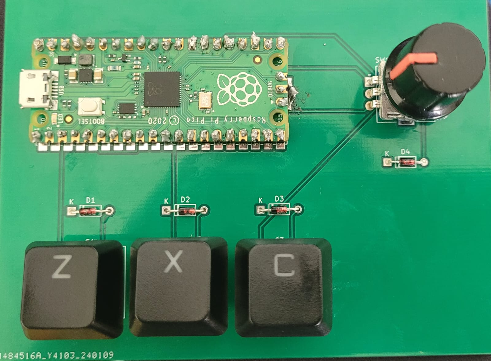
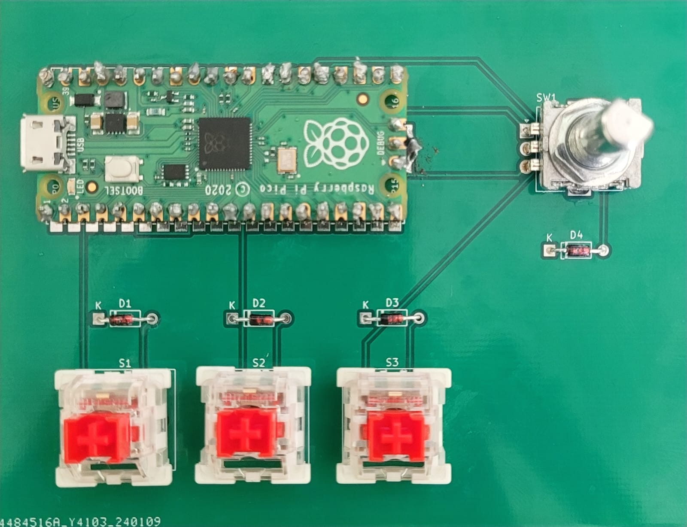

# PiPico-3Key-Macropad 

A 3-Key Macropad with an EC-11 rotary encoder.(**Case Not Included**)

This project is interfaced with a [Raspberry Pi Pico](https://www.raspberrypi.com/documentation/microcontrollers/raspberry-pi-pico.html) along with [CircuitPython](https://circuitpython.org/) and [KMK Firmware](http://kmkfw.io/)

### Components:
1. Raspberry Pi Pico - 1
2. EC-11(switch type) Rotary Encoder - 1
3. 1N4148 Zener Diodes - 4
4. MX Keyswitches - 3

## Project Details:
* This repository includes the Schematic File, PCB file, and Gerber Files.
* The Rotary encoder has been configured to be used as a Volume control knob and the button to mute.
* The 3 key switches have been mapped to Z, X and C.
* The [boot.py](boot.py) file is included to ensure the keypad is not detected as a drive every time.
* Hold down the "Z" key when connecting the keypad to your device again to use the Pico as a drive again.

## Final Look:

### 3D Render:

### Future Changes(ETA : Dunno):
* Make a 3d Printed Case for the PCB
